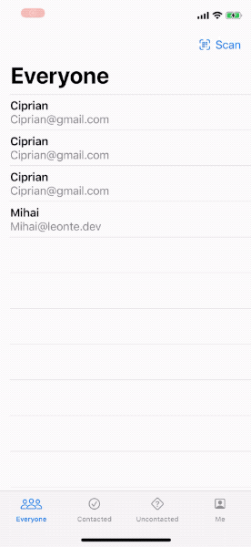

# HotProspects

**Project description.**



#### Technologies used:
- SwiftUI (@EnvironmentObject, TabView)

## Day 79

### @EnvironmentObject

Environment objects use the same ObservableObject protocol as @ObservedObject.

```Swift
struct ContentView: View {
    let user = User()

    var body: some View {
        VStack {
            EditView()
            DisplayView()
        }.environmentObject(user)
    }
} 

struct EditView: View {
    @EnvironmentObject var user: User

    var body: some View {
        TextField("Name", text: $user.name)
    }
}
```

That @EnvironmentObject property wrapper will automatically look for a User instance in the environment, and place whatever it finds into the user property. If it can’t find a User in the environment the app will just crash.

### TabView & the tabItem() modifier 

```Swift
TabView {
    Text("Tab 1")
        .tabItem {
            Image(systemName: "star")
            Text("One")
        }

    Text("Tab 2")
        .tabItem {
            Image(systemName: "star.fill")
            Text("Two")
        }
} 
```

## Day 80

### Result type

```Swift
func fetchData(from urlString: String, completion: @escaping (Result<String, NetworkError>) -> Void) {
    // check the URL is OK, otherwise return with a failure
    guard let url = URL(string: urlString) else {
        completion(.failure(.badURL))
        return
    }

    URLSession.shared.dataTask(with: url) { data, response, error in
        // the task has completed – push our work back to the main thread
        DispatchQueue.main.async {
            if let data = data {
                // success: convert the data to a string and send it back
                let stringData = String(decoding: data, as: UTF8.self)
                completion(.success(stringData))
            } else if error != nil {
                // any sort of network failure
                completion(.failure(.requestFailed))
            } else {
                // this ought not to be possible, yet here we are
                completion(.failure(.unknown))
            }
        }
    }.resume()
} 
```

And then just switch on the Result:

```Swift
Text("Hello, World!")
    .onAppear {
        self.fetchData(from: "https://www.apple.com") { result in
            switch result {
            case .success(let str):
                print(str)
            case .failure(let error):
                switch error {
                case .badURL:
                    print("Bad URL")
                case .requestFailed:
                    print("Bad URL")
                case .unknown:
                    print("Unknown error")
                }
            }
        }
    } 
```

### Manually publishing ObservableObject changes

```Swift
class DelayedUpdater: ObservableObject {

    //instead of @Published
    var value = 0 {
        willSet {
            objectWillChange.send()
        }
    } 


}
```

### Controlling image interpolation in SwiftUI

To see the stretched image retain its pixellated look:

```Swift
Image("example")
    .interpolation(.none)    
    .resizable()
    .scaledToFit()
    .frame(maxHeight: .infinity)
    .background(Color.black)
    .edgesIgnoringSafeArea(.all) 
```

## Day 81

### Context Menus

Just add a .contextMenu {} modifier to a View and provide Buttons with a Text and an Image.

### Local Notifications

import UserNotifications

### Swift Package Manager


## Day 82
- Building our tab bar
- Sharing data across tabs using @EnvironmentObject
- Dynamically filtering a SwiftUI List


## Day 83
- Generating and scaling up a QR code
- Scanning QR codes with SwiftUI
- Adding options with a context menu

## Day 84
- Saving and loading data with UserDefaults
- Posting notifications to the lock screen

## Day 85 Challenges
1. Add an icon to the “Everyone” screen showing whether a prospect was contacted or not.
2. Use JSON and the documents directory for saving and loading our user data.
3. Use an action sheet to customize the way users are sorted in each screen – by name or by most recent.
